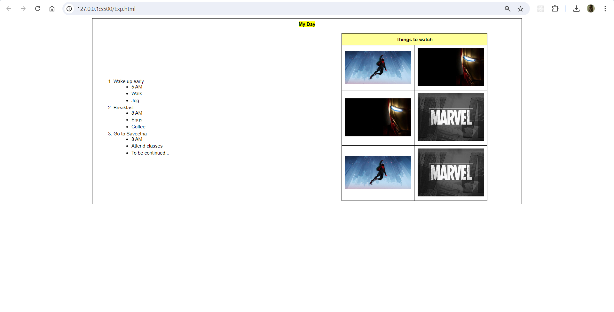
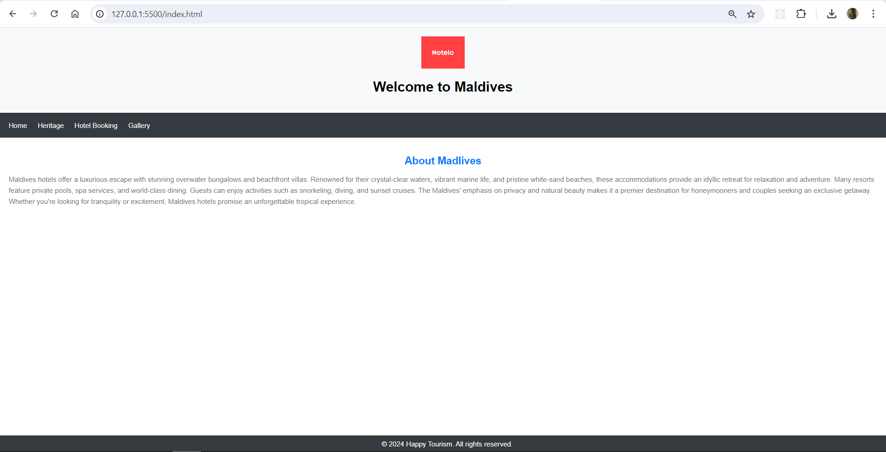
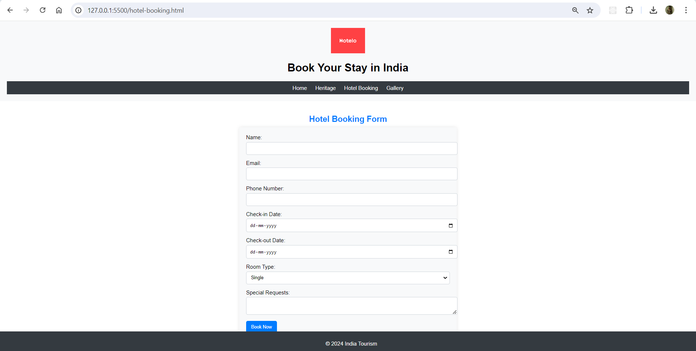
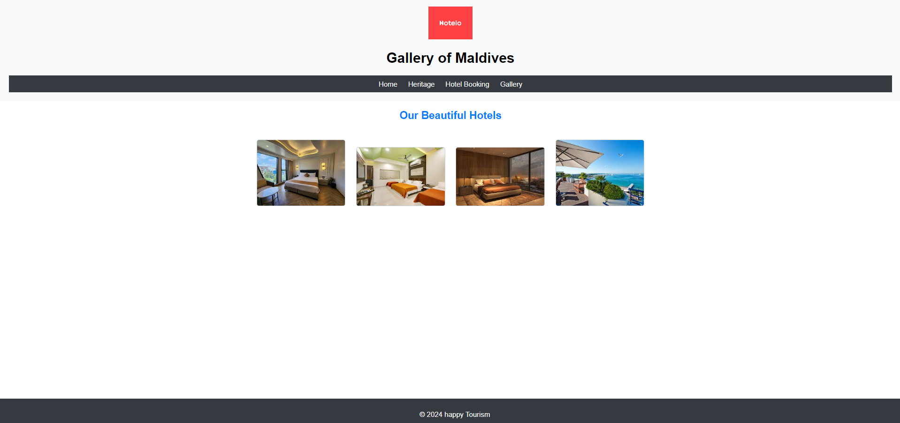

# html-city-tourism
## exercise 01:
```
<!DOCTYPE html>
<html>
<head>
<title>My Day</title>
<style>
  body {
    margin: 0; /* Remove default margins for full-page view */
    font-family: Arial, sans-serif;
  }

  .center {
    text-align: center;
  }

  .highlight {
    background-color: #ffff99;
  }

  table {
    border-collapse: collapse;
    width: 70%; /* Reduce table width to 70% */
    margin: 0 auto; /* Center the table horizontally */
  }

  th {
    border: 1px solid black;
    padding: 10px;
  }

  td {
    border: 1px solid black;
    padding: 10px;
  }

  td:first-child {
    width: 50%; /* Set width for activity description column */
  }

  td:last-child img {
    width: 100%; /* Images stretch to fill remaining space */
  }

  ol {
    margin-left: 20px; /* Indent list for readability */
  }

  ul {
    margin-left: 20px; /* Indent sub-list for readability */
    list-style-type: disc; /* Change to desired list style (e.g., circle) */
  }

  li {
    margin-bottom: 5px; /* Add space between list items */
  }
</style>
</head>
<body>
<table cellpadding="0" cellspacing="0"> <tr>
    <th colspan="2" class="center"><mark>My Day</mark></th>
  </tr>
  <tr>
    <td>
      <ol>
        <li>Wake up early
          <ul>
            <li>5 AM</li>
            <li>Walk</li>
            <li>Jog</li>
          </ul>
        </li>
        <li>Breakfast
          <ul>
            <li>8 AM</li>
            <li>Eggs</li>
            <li>Coffee</li>
          </ul>
        </li>
        <li>Go to Saveetha
          <ul>
            <li>8 AM</li>
            <li>Attend classes</li>
            <li>To be continued...</li>
          </ul>
        </li>
      </ol>
    </td>
    <td>
      <table>
        <tr>
          <th colspan="2" class="center highlight">Things to watch</th>
        </tr>
        <tr>
          <td></td>
          <td></td>
        </tr>
        <tr>
          <td></td>
          <td></td>
        </tr>
        <tr>
          
          <td></td>
            <td></td>
        </tr>
      </table>
    </td>
  </tr>
</table>
</body>
</html>
```

## output:



## Hotels:
## index.html:
```
<!DOCTYPE html>
<html lang="en">
<head>
    <meta charset="UTF-8">
    <meta name="viewport" content="width=device-width, initial-scale=1.0">
    <title>Welcome to XYZ City</title>
    <style>
        body {
            font-family: Arial, sans-serif;
            margin: 0;
            padding: 0;
            box-sizing: border-box;
        }
        header {
            background-color: #f8f9fa;
            padding: 20px;
            text-align: center;
        }
        header img {
            max-width: 100px;
        }
        nav {
            background-color: #343a40;
            padding: 10px;
        }
        nav a {
            color: #ffffff;
            text-decoration: none;
            padding: 10px;
            display: inline-block;
        }
        nav a:hover {
            background-color: #495057;
        }
        .container {
            padding: 20px;
        }
        footer {
            background-color: #343a40;
            color: #ffffff;
            text-align: center;
            padding: 10px;
            position: fixed;
            width: 100%;
            bottom: 0;
        }
        h2 {
            text-align: center;
            color: #007bff;
            font-size: 24px;
            margin-bottom: 10px;
        }
        p {
            color: #6c757d;
            font-size: 16px;
            line-height: 1.6;
        }
    </style>
</head>
<body>

<header>
    
    <h1>Welcome to Maldives</h1>
</header>

<nav>
    <a href="index.html">Home</a>
    <a href="heritage.html">Heritage</a>
    <a href="hotel-booking.html">Hotel Booking</a>
    <a href="gallery.html">Gallery</a>
</nav>

<div class="container">
    <h2>About Madlives</h2>
    <p>Maldives hotels offer a luxurious escape with stunning overwater bungalows and beachfront villas. Renowned for their crystal-clear waters, vibrant marine life, and pristine white-sand beaches, these accommodations provide an idyllic retreat for relaxation and adventure. Many resorts feature private pools, spa services, and world-class dining. Guests can enjoy activities such as snorkeling, diving, and sunset cruises. The Maldives' emphasis on privacy and natural beauty makes it a premier destination for honeymooners and couples seeking an exclusive getaway. Whether you're looking for tranquility or excitement, Maldives hotels promise an unforgettable tropical experience.</p>
</div>

<footer>
    &copy; 2024 Happy Tourism. All rights reserved.
</footer>

</body>
</html>

```


## gallery.html:
```
<!DOCTYPE html>
<html lang="en">
<head>
    <meta charset="UTF-8">
    <meta name="viewport" content="width=device-width, initial-scale=1.0">
    <title>Gallery</title>
    <style>
        body {
            font-family: Arial, sans-serif;
            margin: 0;
            padding: 0;
            box-sizing: border-box;
        }
        header {
            background-color: #f8f9fa;
            padding: 20px;
            text-align: center;
        }
        header img {
            max-width: 100px;
        }
        nav ul {
            list-style: none;
            padding: 0;
            margin: 0;
            background-color: #343a40;
        }
        nav ul li {
            display: inline;
        }
        nav ul li a {
            color: #ffffff;
            text-decoration: none;
            padding: 10px;
            display: inline-block;
        }
        nav ul li a:hover {
            background-color: #495057;
        }
        .gallery {
            padding: 20px;
            text-align: center;
        }
        .gallery img {
            width: 200px;
            height: auto;
            margin: 10px;
            border: 2px solid #ced4da;
            border-radius: 5px;
        }
        footer {
            background-color: #343a40;
            color: #ffffff;
            text-align: center;
            padding: 10px;
            position: fixed;
            width: 100%;
            bottom: 0;
        }
        h2 {
            text-align: center;
            color: #007bff;
            font-size: 24px;
            margin-bottom: 10px;
        }
    </style>
</head>
<body>
    <header>
        
        <h1>Gallery of Maldives</h1>
        <nav>
            <ul>
                <li><a href="index.html">Home</a></li>
                <li><a href="heritage.html">Heritage</a></li>
                <li><a href="hotel-booking.html">Hotel Booking</a></li>
                <li><a href="gallery.html">Gallery</a></li>
            </ul>
        </nav>
    </header>
    <main>
        <section>
            <h2>Our Beautiful Hotels</h2>
            <div class="gallery">
                
                
                
                
            </div>
        </section>
    </main>
    <footer>
        <p>&copy; 2024 happy Tourism</p>
    </footer>
</body>
</html>


```
## hotel-booking.html:
```
<!DOCTYPE html>
<html lang="en">
<head>
    <meta charset="UTF-8">
    <meta name="viewport" content="width=device-width, initial-scale=1.0">
    <title>Hotel Booking</title>
    <style>
        body {
            font-family: Arial, sans-serif;
            margin: 0;
            padding: 0;
            box-sizing: border-box;
        }
        header {
            background-color: #f8f9fa;
            padding: 20px;
            text-align: center;
        }
        header img {
            max-width: 100px;
        }
        nav ul {
            list-style: none;
            padding: 0;
            margin: 0;
            background-color: #343a40;
        }
        nav ul li {
            display: inline;
        }
        nav ul li a {
            color: #ffffff;
            text-decoration: none;
            padding: 10px;
            display: inline-block;
        }
        nav ul li a:hover {
            background-color: #495057;
        }
        .booking-form-container {
            padding: 20px;
        }
        .hotel-booking-form {
            max-width: 600px;
            margin: 0 auto;
            background-color: #f8f9fa;
            padding: 20px;
            border-radius: 5px;
            box-shadow: 0 0 10px rgba(0, 0, 0, 0.1);
        }
        .form-group {
            margin-bottom: 15px;
        }
        .form-group label {
            display: block;
            margin-bottom: 5px;
        }
        .form-group input,
        .form-group select,
        .form-group textarea {
            width: 100%;
            padding: 10px;
            border: 1px solid #ced4da;
            border-radius: 5px;
        }
        .form-group button {
            background-color: #007bff;
            color: #ffffff;
            border: none;
            padding: 10px 15px;
            border-radius: 5px;
            cursor: pointer;
        }
        .form-group button:hover {
            background-color: #0056b3;
        }
        footer {
            background-color: #343a40;
            color: #ffffff;
            text-align: center;
            padding: 10px;
            position: fixed;
            width: 100%;
            bottom: 0;
        }
        h2 {
            text-align: center;
            color: #007bff;
            font-size: 24px;
            margin-bottom: 10px;
        }
    </style>
</head>
<body>
    <header>
        
        <h1>Book Your Stay in India</h1>
        <nav>
            <ul>
                <li><a href="index.html">Home</a></li>
                <li><a href="heritage.html">Heritage</a></li>
                <li><a href="hotel-booking.html">Hotel Booking</a></li>
                <li><a href="gallery.html">Gallery</a></li>
            </ul>
        </nav>
    </header>
    <main>
        <section class="booking-form-container">
            <h2>Hotel Booking Form</h2>
            <form class="hotel-booking-form" action="submit-booking" method="post">
                <div class="form-group">
                    <label for="name">Name:</label>
                    <input type="text" id="name" name="name" required>
                </div>
                <div class="form-group">
                    <label for="email">Email:</label>
                    <input type="email" id="email" name="email" required>
                </div>
                <div class="form-group">
                    <label for="phone">Phone Number:</label>
                    <input type="tel" id="phone" name="phone" required>
                </div>
                <div class="form-group">
                    <label for="checkin">Check-in Date:</label>
                    <input type="date" id="checkin" name="checkin" required>
                </div>
                <div class="form-group">
                    <label for="checkout">Check-out Date:</label>
                    <input type="date" id="checkout" name="checkout" required>
                </div>
                <div class="form-group">
                    <label for="room">Room Type:</label>
                    <select id="room" name="room" required>
                        <option value="single">Single</option>
                        <option value="double">Double</option>
                        <option value="suite">Suite</option>
                    </select>
                </div>
                <div class="form-group">
                    <label for="special-requests">Special Requests:</label>
                    <textarea id="special-requests" name="special-requests"></textarea>
                </div>
                <div class="form-group">
                    <button type="submit">Book Now</button>
                </div>
            </form>
        </section>
    </main>
    <footer>
        <p>&copy; 2024 India Tourism</p>
    </footer>
</body>
</html>


```


## output:





